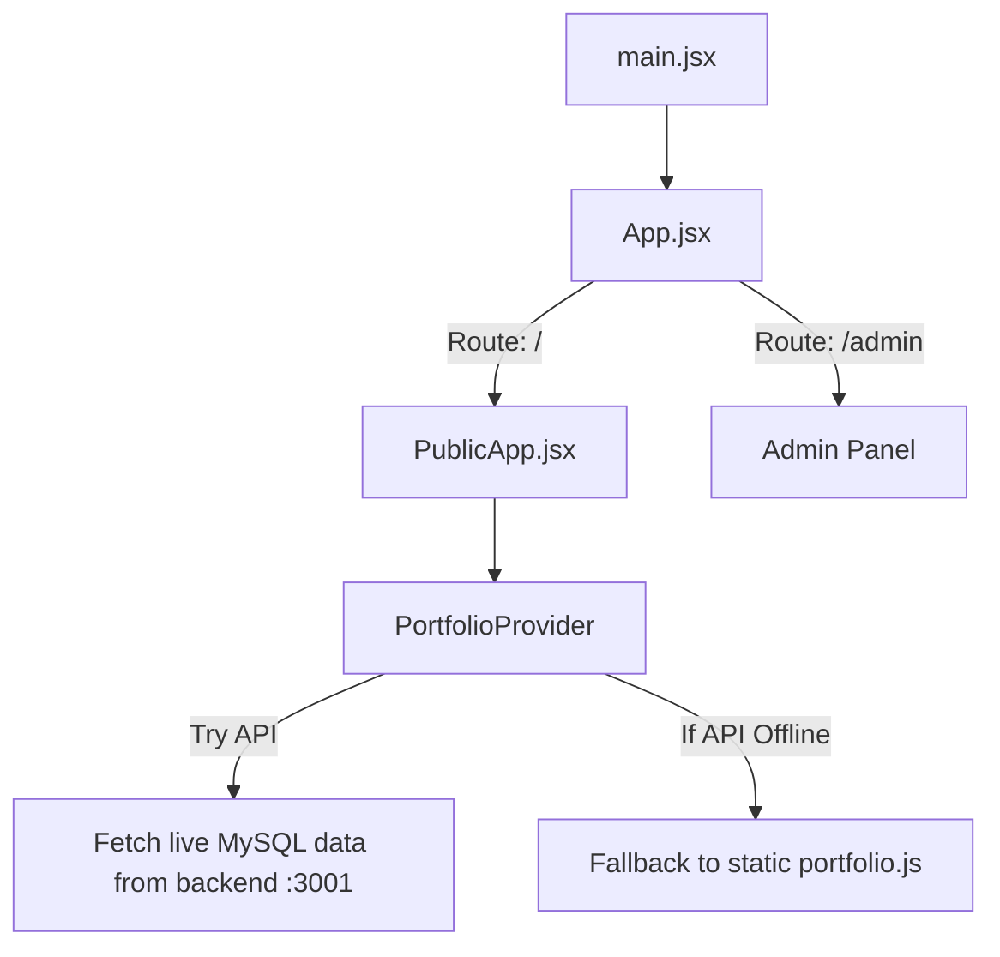

# Shubham Jani — Portfolio Frontend

This is the React.js client application for the Shubham Jani Portfolio site. It is built using **React**, **Vite**, and **Tailwind CSS**. It includes both the public-facing portfolio website and a secure, interactive **Admin Panel** to manage site data.

---

## 🚀 Installation & Setup

Follow these steps to set up and run the frontend application locally.

### Prerequisites
* Ensure you have **Node.js** (v18.x or later) and **npm** installed.

### 1. Install Dependencies
Navigate into the `Portfolio` folder and install the required npm packages:
```bash
cd Portfolio
npm install
```

### 2. Run the Development Server
Start the Vite dev server by running:
```bash
npm run dev
```
* **Public Portfolio:** [http://localhost:5173](http://localhost:5173)
* **Admin Dashboard:** [http://localhost:5173/admin](http://localhost:5173/admin)

> [!NOTE]
> The frontend development server utilizes a proxy to forward API requests to `http://localhost:3001`. For the admin panel to load live database entries, make sure the backend server (FastAPI) in `App_Server` is running on port 3001.

---

## 📂 Frontend Folder Structure

The code is modularly structured inside the `src/` folder:

```text
src/
├── admin/          # React Admin Dashboard pages & authentication views
├── api/            # API client wrapper (client.js) using Fetch API
├── assets/         # Styles, SVG files, and visual media resources
├── Components/     # Reusable layout and design elements (Navbar, Footer, SkillOrbit, Fx)
├── context/        # React Context Provider (PortfolioContext.jsx) managing global state
├── data/           # Static portfolio data fallbacks (portfolio.js & staticPortfolio.js)
├── hooks/          # Custom hooks (e.g., useLiteMode.js for performance detection)
├── Sections/       # Sections of the single-page layout (Hero, About, Projects, Experience)
├── utils/          # Auxiliary helper utilities (e.g., media path resolving)
├── App.jsx         # App routing setup (react-router-dom)
└── main.jsx        # App mounting entry point
```

---

## 🔄 Application & Data Flow



### 1. Startup Flow
1. **Entry Point:** The application mounts at `main.jsx` and runs `App.jsx`.
2. **Routing:** `App.jsx` divides incoming traffic:
   * `/` routes to `PublicApp.jsx` (the public portfolio page).
   * `/admin` routes to the Admin Dashboard (protected by login credentials).

### 2. Data Loading Flow
* **Context Wrapper:** Both components are wrapped by `PortfolioProvider` (defined in [PortfolioContext.jsx](src/context/PortfolioContext.jsx)).
* **API Check:** On mount, `PortfolioProvider` calls `fetchPortfolio()` (defined in [client.js](src/api/client.js)).
  * **Success:** It normalizes the data returned from the backend (MySQL database) and updates the UI state.
  * **Failure:** If the API is offline, it catches the error and defaults to reading your local static mock data in [portfolio.js](src/data/portfolio.js).

### 3. Admin Save & Real-Time Sync Flow
1. The admin makes updates in the dashboard (e.g., adding a project or changing bio tags) and clicks **Save**.
2. The frontend sends a `PUT` request containing the payload to `/api/portfolio` on the backend.
3. The backend saves the new record inside the MySQL database and responds with a success status.
4. The frontend triggers a custom window event (`portfolio-updated`) and emits an `"updated"` command on a cross-tab `BroadcastChannel`.
5. All open tabs in the user's browser automatically detect the update event and reload their state in real-time.

---

## ⚡ Performance Optimization (Lite Mode)

For low-spec phones, data-saving networks, or users who prefer reduced motion, the app runs the custom hook [useLiteMode.js](src/hooks/useLiteMode.js). 

When activated:
* It sets `data-perf="lite"` on the `<html>` document root to disable complex CSS animations.
* It disables high-load canvas operations (like particle backgrounds in `ParticlesBackground.jsx`).
* It simplifies rendering logic on resource-heavy visual components (like the interactive 3D `SkillOrbit.jsx`).
